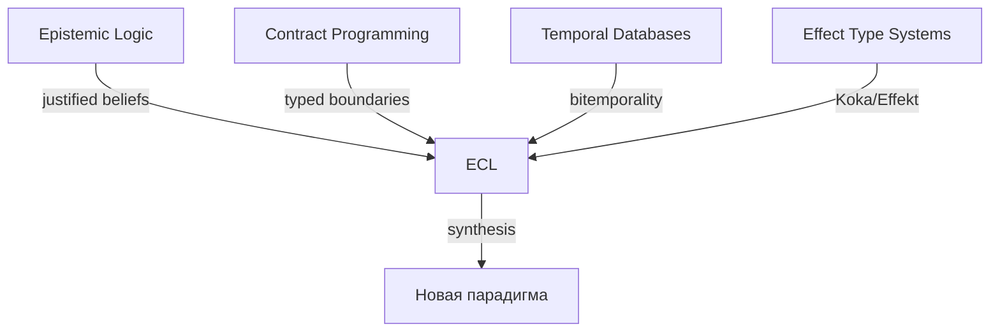

# Igniter-Lang: Стратегический Анализ и Рекомендации

**Дата**: 2026-05-06
**Контекст**: Полный анализ спецификации `igniter-lang/` — 17 PROP-документов, 65 треков, 12 bridge-профилей, исходники, эксперименты, fixture-доказательства

---

## I. Текущая Идентичность: Что Уже Есть

Igniter-Lang самоопределяется как **Epistemic Contract Language (ECL)** — язык, в котором:

```
Каждое вычисление = контракт + явное время + наблюдение с доказательством
Каждый результат  = justified belief, а не просто значение
Каждый эффект     = CORE (детерминированный) | ESCAPE (декларированный) | OOF (запрещён)
```

### Ядро спецификации (на сегодня)

| Слой | Статус | Ключевой документ |
|------|--------|-------------------|
| Семантический домен | ✅ формализован | PROP-001: V, T, Tt, C, Expr, O, F |
| Алгебра композиции | ✅ формализована | PROP-002: >>, \|\|, branch, over, embed |
| Классификатор фрагментов | ✅ формализован | PROP-003: CORE/ESCAPE/OOF |
| Система типов | ✅ формализована | PROP-004: структурные типы, Projection[T,horizon], Obs[kind,T] |
| Полиморфизм/Трейты | ✅ формализован | PROP-016: generic contracts, traits, monomorphization |
| RuntimeMachine lifecycle | ✅ доказана | PROP-011: boot→load→evaluate→checkpoint→resume |
| SemanticImage + Resume | ✅ доказан | PROP-009: типизированный handoff между сессиями |
| Schema Evolution | ✅ формализована | PROP-017: SemVer, fingerprint, миграция с receipts |
| Парсер | 🟡 частичный | PROP-014/015: рекурсивный спуск, 3 fixture accepted |
| Compiler frontend | 🔴 отсутствует | parser→classifier→typechecker→SemanticIR — нет полного пути |

### Уникальная позиция (пустой квадрант)

```
Ни один известный язык одновременно не предоставляет:
  1. Temporal explicitness (as_of typed, не ambient)
  2. Lifecycle-typed outputs (:local/:session/:window/:durable/:audit)
  3. CORE/ESCAPE/OOF classification at compile time
  4. Content-addressed observations с provenance chain
  5. Formal bridge от бизнес-контрактов к persistence (TBackend)
  6. Agent-readable semantic images для cross-session resumption
```

---

## II. Парадигмальный Прорыв: ECL → Язык Общего Назначения

### 2.1 Почему ECL — это новая парадигма

ECL синтезирует четыре направления, которые до сих пор существовали отдельно:



> [!IMPORTANT]
> **Ключевой инсайт**: Наблюдение (observation) как единица доверия — не функция. Это фундаментально отличает ECL от функционального программирования. Ближе к epistemic logic, чем к λ-calculus.

### 2.2 Путь к General-Purpose Coverage

Igniter-Lang **не должен** становиться Python или Go. Он должен стать **платформой, на которой строятся domain-specific решения**, оставаясь при этом достаточно выразительным для самокомпиляции.

**Рекомендация: Стратегия "Expanding Core"**

```
Текущий CORE (DAG, fold, bounded collections)
  → Stage 1: Pattern matching + ADT (PROP-016 extension)
  → Stage 2: Bounded recursion через fold_until + explicit stack
  → Stage 3: String/IO stdlib через ESCAPE FFI
  → Stage 4: Self-hosting compiler (Stage 1-5 из runtime-model-spec)
  → Stage 5: LLVM backend для pure compute
```

**Конкретные шаги к general-purpose**:

| Gap | Решение | Приоритет |
|-----|---------|-----------|
| Нет рекурсии | `fold_until` с explicit stack (уже специфицирован) | Critical |
| Нет pattern matching | ADT + match expressions поверх PROP-016 traits | Critical |
| Нет строковых операций | ESCAPE FFI stdlib для Stage 2 self-hosting | High |
| Нет IO | Contractable FFI (уже доказан для Ruby) | High |
| Нет concurrency primitives | Structural DAG parallelism (уже специфицирован) | Medium |

> [!TIP]
> **Стратегический инсайт**: Igniter-Lang не конкурирует с Python/Go в области «напиши скрипт за 5 минут». Он конкурирует в области «напиши систему, которую можно аудитировать, объяснить, воспроизвести и передать агенту». Это другой рынок, и он растёт быстрее.

### 2.3 Языковая Иерархия: ECL как Meta-Protocol

```
Level 0: Igniter-Lang Core (CORE fragment)
  — deterministic, bounded, reproducible
  — self-hosting compiler target

Level 1: Igniter-Lang Extended (CORE + ESCAPE)
  — real-world IO, FFI, TBackend
  — business applications, CRM, ERP

Level 2: Igniter-Lang Ecosystem (domain contracts)
  — OSINT contracts, simulation contracts, inference contracts
  — каждый домен = набор typed contracts над общим ядром

Level 3: Igniter-Lang Network (distributed RuntimeMachines)
  — mesh clusters, agent handoff, distributed SemanticImage
```

---

## III. OSINT-Like Продукты: Фрактальная Трaceability

### 3.1 Текущее Состояние

Спецификация уже содержит глубоко проработанный OSINT-слой:

- **Claim lifecycle**: asserted → inferred → contradicted → corrected → superseded
- **SourceProvenance**: 5 классов (direct, corroborated, derivative, disputed, unknown)
- **EvidenceLink**: rel + strength vocabulary
- **ConfidenceAssessment**: label ≠ truth (принципиально)
- **ContradictionReport + CorrectionReceipt**: lifecycle противоречий
- **FactCheckSnapshot**: воспроизводимый снимок анализа
- **InferenceContract**: Datalog-подобный bounded inference

### 3.2 Почему Это Фрактально

```
Фрактальность = одна и та же структура повторяется на каждом уровне:

language axiom
  → grammar/type rule
  → contract
  → observation
  → source evidence
  → claim
  → inference
  → contradiction
  → report
  → action
  → correction
```

> [!IMPORTANT]
> **Ключевой инсайт**: OSINT — не «приложение на Igniter-Lang». Это **натуральная проекция** языковой модели. Язык, в котором каждое значение — justified belief с evidence chain, *по определению* является OSINT-движком.

### 3.3 Продуктовые Направления

#### A. Personal/Business Intelligence Assistant

Уже специфицирован в `personal-osint-assistant-product-pressure-v0.md`:

```
Watchlist → Source Collection → Claim Extraction → Grouping
  → Contradiction Detection → Fact-Check Snapshot
  → Evidence-Linked Alert → Human Review → Audit Report
```

**Конкретные продуктовые поверхности**:

| Surface | Igniter-Lang Primitive | Unique Value |
|---------|----------------------|--------------|
| Daily Brief | DailyBrief contract | Evidence-linked, not AI summary |
| Contradiction Alert | ContradictionReport | Typed conflict with temporal overlap |
| Reputation Drift | ReputationDriftReport | Windowed, caveated, source-separated |
| Audit Report | AuditReadyReport | Reproducible snapshot with full chain |
| Claim Timeline | ClaimTimeline | Ordered, with corrections and supersedes |

#### B. Competitive Intelligence Platform

Расширение Personal Assistant для команд:

```
Shared Watchlists + Role-based Redaction + Team Review Workflow
  + Analyst Decision Receipts + Cross-team Contradiction Resolution
```

#### C. Supply Chain / Vendor Risk Monitor

```
VendorWatchlist → API Status Claims → SLA Evidence
  → Drift Detection → Risk Scoring (caveated, not truth)
  → Procurement Decision Support (review-gated)
```

### 3.4 Рекомендации для OSINT направления

1. **Logical Inference Contract** — реализовать bounded Datalog-like inference (уже специфицирован). Это даёт OSINT продукту *объяснимый* вывод, а не black-box ML.

2. **Citation/Redaction Policy** как first-class type — каждый публичный output ОБЯЗАН нести CitationPolicy. Это юридический differentiator.

3. **AgentActionLimit** как capability contract — агент-ассистент явно ограничен в действиях, и эти ограничения аудируемы.

4. **NOT an ML wrapper** — позиционировать как альтернативу «AI-powered OSINT», где trust = evidence chain, а не model confidence.

---

## IV. Децентрализованные Агентные Системы и Mesh Кластеры

### 4.1 Что Уже Есть для Distributed

```
SemanticImage        = typed, content-addressed checkpoint of semantic state
CompatibilityReport  = formal gate for resume/handoff
RuntimeMachine       = lifecycle owner (boot/load/evaluate/checkpoint/resume)
TBackend             = pluggable persistence with replay semantics
RuntimeContract      = typed promise about execution environment
```

### 4.2 Модель Распределённого Агента

Igniter-Lang *натурально* моделирует multi-agent системы:

```
Agent = RuntimeMachine instance
  + loaded CompiledProgram
  + active SemanticImage
  + TBackend adapter (local or networked)
  + capability gates

Handoff = SemanticImage + CompatibilityReport
  Agent A checkpoints → publishes SemanticImage
  Agent B loads → verifies CompatibilityReport → resumes

Mesh = composition of RuntimeContracts
  RuntimeA + RuntimeB + RuntimeC
  → RuntimeCompositionContract
  → visible: who evaluated what, at which temporal horizon
```

### 4.3 Что Нужно Добавить для Mesh Clusters

> [!WARNING]
> Distribution — acknowledged blind spot (W-7 в position report). PROP-006 помечает distributed как ESCAPE, но не определяет формально.

**Необходимые расширения**:

| Primitive | Назначение | Статус |
|-----------|-----------|--------|
| `PartialOrder` / Vector Clocks | Causal consistency across nodes | Не специфицирован |
| `DistributedCapabilityGrant` | Delegation across node boundaries | Не специфицирован |
| `MeshTopology` contract | Typed cluster membership and routing | Не специфицирован |
| `ConsensusReceipt` | Agreement evidence across nodes | Не специфицирован |
| `PartitionObservation` | Network split evidence | Не специфицирован |
| `EventualConsistencyWindow` | Typed convergence horizon | Не специфицирован |

**Рекомендуемая архитектура**:

```
Layer 1: Single RuntimeMachine (уже есть)
Layer 2: Federated RuntimeMachines (SemanticImage handoff)
  — каждый node автономен
  — handoff через compatible SemanticImage
  — TBackend может быть distributed (CockroachDB, FoundationDB)

Layer 3: Mesh Cluster (proactive agents)
  — agent discovery через contract registry
  — capability-gated inter-agent calls
  — causal ordering через typed vector clocks
  — partition-aware evaluation (degrade, not crash)
```

### 4.4 Proactive Agent Model

```
ProactiveAgent = RuntimeMachine + WatchContract + ActionPolicy

WatchContract:
  — monitors TBackend facts
  — evaluates trigger conditions at explicit temporal horizon
  — produces AlertObservation when conditions met

ActionPolicy:
  — maps AlertObservation to candidate actions
  — requires CapabilityGate for each action
  — produces ActionReceipt or HumanReviewRequest

ProactiveLoop:
  observe → evaluate → alert → propose → [human review] → act → receipt
```

> [!TIP]
> **Стратегический инсайт**: Igniter-Lang's SemanticImage + CompatibilityReport — это *готовый* примитив для agent handoff. Ни один существующий agent framework (LangChain, CrewAI, AutoGen) не имеет типизированного, content-addressed, verifiable handoff. Это **killer feature** для enterprise multi-agent systems.

---

## V. ERP/CRM, Планирование и Бизнес-Процессы

### 5.1 Текущая Доказательная База

Spark CRM — основной applied pressure lane. Уже специфицированы и/или доказаны:

| Fixture | Статус | Покрытие |
|---------|--------|----------|
| Technician Availability | ✅ executable | TenantScope, ScopedFactRead, PipelineStep, why-not reasons |
| Lead Signal Boundary | ✅ executable | Idempotency, Decimal rollup, duplicate suppression, retention |
| Operation Action Lifecycle | ✅ executable | ActionPolicy, request/execution receipts, duplicate no-op |
| Pipeline Grammar | ✅ parser accepted | pipeline/step/scoped_by/cardinality/tenant_free |

### 5.2 Модель ERP/CRM на Igniter-Lang

```
ERP/CRM System = набор контрактов:

TenantScope           → кто видит какие данные
Pipeline              → Result.flat_map + StepObservation (fail-fast)
ActionPolicy          → visible vs executable actions
OperationReceipt      → доказательство выполнения
SchemaEvolution       → миграция без потери аудит-следа
TemporalProjection    → "что было в момент T" для любого бизнес-факта
DiagnosticReason      → "почему отказано" для любого шага
```

### 5.3 Конкретные ERP/CRM Capabilities

#### Planning & Scheduling
```
AvailabilityProjection
  + CapacityModel (WorldModel для scheduling)
  + ConstraintSatisfaction (ESCAPE with solver receipt)
  → ScheduleCandidate (не approved action!)
  → HumanReview → ApprovedSchedule → ExecutionReceipt
```

#### Logistics
```
RouteSegmentSnapshot → VehicleAvailability → DeliveryWindow
  + GeoSignal stream → real-time position
  + Constraint: time windows, capacity, priority
  → RouteOptimization (ESCAPE solver + receipt)
  → DispatchDecision (capability-gated + auditable)
```

#### Business Process Orchestration
```
Pipeline = typed sequence of steps
  step(validate) >> step(enrich) >> step(decide) >> step(execute) >> step(notify)

Каждый step:
  → StepObservation (evidence of execution)
  → FailureObservation (why it failed)
  → CompensationContract (Saga-style undo if needed)
```

> [!IMPORTANT]
> **Gap**: CompensationContract (Saga model) — специфицирован как T-4 в position report, но не формализован. Это **critical** для production ERP/CRM.

### 5.4 Рекомендации для ERP/CRM

1. **CompensationContract** — формализовать немедленно. Без Saga-модели невозможны реальные бизнес-процессы с несколькими ESCAPE-шагами.

2. **ApprovalWorkflow** как первоклассный контракт — `ActionPolicy → HumanReview → ApprovedAction → ExecutionReceipt`. Это покрывает 80% бизнес-логики в ERP.

3. **Decimal[scale:S]** — уже формализован. Убедиться, что он покрывает все financial use cases (currency arithmetic, rounding policies, tax calculations).

4. **Multi-tenant** — TenantScope уже есть. Нужно формализовать cross-tenant operations и tenant isolation guarantees.

---

## VI. Моделирование Из Коробки

### 6.1 Simulation Framework (уже специфицирован)

```
WorldModel + AssumptionSet + ParameterSet + Intervention
  → ScenarioRun
  → SyntheticObservation / CounterfactualObservation / ForecastObservation
  → ComparisonReport
  → ModelValidityReport
```

**Фундаментальное правило**:
```
simulation_success ≠ production truth
counterfactual_improvement ≠ authorized operational action
```

### 6.2 Поддерживаемые Методологии Моделирования

| Методология | Igniter-Lang Fit | Статус |
|-------------|-----------------|--------|
| Discrete Event Simulation | Отличный — fold over event list | ✅ fixture exists |
| Digital Twin | Сильный — calibration + observation evidence | 🟡 specified |
| Agent-Based Modeling | Хороший — contract-addressable agents | 🟡 specified |
| System Dynamics | Средний — needs continuous quantities | 🔴 not started |
| Causal Modeling | Хороший — Intervention ≠ Observation | 🟡 specified |
| Monte Carlo | Средний — needs ESCAPE with seed policy | 🟡 OOF rules specified |
| Bayesian Modeling | Средний — prior/posterior evidence-linked | 🔴 not started |
| Optimization/OR | Средний — solver as ESCAPE with receipt | 🟡 specified |
| Game Theory | Начальный — agent assumptions explicit | 🔴 not started |
| Genetic Algorithms | Средний — search over typed candidates | 🟡 specified |

### 6.3 Точные Науки

**Физическое моделирование**:
```
PhysicalModel : WorldModel
  + DifferentialEquation set (ESCAPE solver)
  + InitialConditions (typed parameters)
  + SimulationStep (bounded, deterministic or seeded)
  → TrajectoryObservation (SyntheticObservation)
  → ExperimentalValidation (RealObservation comparison)
```

**Химия / Биоинформатика**:
```
MolecularModel : WorldModel
  + ReactionRules (InferenceContract-like)
  + ConcentrationFacts
  + KineticParameters
  → ReactionPathway (ProofTrace analogue)
  → PredictedYield (ForecastObservation with confidence)
```

**Эпидемиология**:
```
EpidemiologicalModel : WorldModel
  + PopulationParameters
  + TransmissionRules (ABM agents)
  + InterventionPolicy (vaccination, lockdown)
  → InfectionCurve (SyntheticObservation)
  → PolicyComparison (ComparisonReport)
  → ModelValidityReport (calibration against real data)
```

### 6.4 Гуманитарные Науки

**Экономическое моделирование**:
```
EconomicModel : WorldModel
  + AgentPopulation (consumers, firms, government)
  + BehaviorRules (utility maximization, policy rules)
  + MarketMechanism (price discovery)
  → EquilibriumObservation (SyntheticObservation)
  → PolicyImpactAnalysis (ComparisonReport)
```

**Социологическое / Network моделирование**:
```
SocialNetworkModel : WorldModel
  + AgentPopulation (individuals, groups)
  + InteractionRules (influence, information spread)
  + NetworkTopology
  → DiffusionPattern (SyntheticObservation)
  → InterventionEffect (CounterfactualObservation)
```

> [!TIP]
> **Стратегический инсайт**: Ключевое преимущество Igniter-Lang для научного моделирования — **reproducibility by construction**. Каждый simulation run несёт assumptions, parameters, model version, temporal scope, и calibration evidence. Это решает кризис воспроизводимости в науке *на уровне языка*.

### 6.5 Рекомендации для Моделирования

1. **ContinuousQuantity type** — для System Dynamics и физического моделирования нужен typed numeric semantics для непрерывных величин (не только Decimal для финансов).

2. **BoundedSimulationLoop** — формализовать как CORE primitive (`simulate(max_steps, state, transition_fn)`), отличный от `fold` семантически.

3. **CalibrationContract** — формализовать связь между SyntheticObservation и RealObservation для Digital Twin calibration.

4. **UncertaintyType** — для Monte Carlo и Bayesian: typed distribution outputs, не scalar values.

---

## VII. Стратегическая Карта: Объединяющая Визия

### 7.1 Единая Формула

```
Igniter-Lang = Epistemic Contract Language
  для observable computation,
  human-agent co-reasoning,
  evidence-native analysis,
  scenario-safe simulation,
  и auditable distributed execution.
```

### 7.2 Competitive Moat

| Capability | Igniter-Lang | Ближайший конкурент | Delta |
|------------|-------------|-------------------|-------|
| Temporal honesty at type level | ✅ | Datalog/Datomic (query only) | Language-wide vs query-only |
| Observation as trust unit | ✅ | Event sourcing (pattern) | Type-enforced vs convention |
| CORE/ESCAPE/OOF trust calc | ✅ | Koka/Effekt (effects only) | Business semantics vs academic |
| Cross-session semantic resume | ✅ | None | Unique |
| Agent-native by construction | ✅ | None | Unique |
| OSINT as language projection | ✅ | None | Unique |
| Simulation trust boundary | ✅ | None at language level | Unique |

### 7.3 Риски и Слабости

> [!CAUTION]
> **Critical risks to address before v1:**

1. **Нет полного compiler pipeline** — parser→classifier→typechecker→SemanticIR не собран. Без этого язык остаётся спецификацией.

2. **Stdlib = stub** — Collection, Option, Result типизированы, но не имеют executable implementation. PROP-013 специфицирован, но не реализован.

3. **ESCAPE algebra** — capability delegation, overlap, revocation не формализованы. Без этого distributed = ad hoc.

4. **Compensation/Saga model** — W-4, не формализован. Без этого ERP/CRM production невозможен.

5. **Distribution semantics** — W-7, помечен как «deferred». Для mesh clusters это blocker.

6. **Developer experience** — ни одного реального IDE, debugger, REPL. Adoption requires tooling.

---

## VIII. Топ-10 Рекомендаций

### Immediate (0-3 месяца)

1. **Собрать compiler frontend** — parser→classifier→typechecker→SemanticIR. Без этого всё остальное — теория. Один инженер, focused sprint.

2. **Executable stdlib** — реализовать PROP-013 (Collection, Option, Result, fold/map/filter) как working code, не только types.

3. **CompensationContract** — формализовать и реализовать T-4. Блокирует все ERP/CRM use cases.

### Short-term (3-6 месяцев)

4. **OSINT MVP** — Personal Intelligence Assistant как первый продукт. Watchlist → Claims → Contradictions → Evidence-Linked Alerts. Synthetic data, lawful boundary.

5. **ESCAPE Composition Algebra** — формализовать T-3. Capability delegation, overlap rules. Блокирует distributed.

6. **REPL/DevKit** — простой интерпретатор для `.igapp` с rich diagnostics. Developer adoption depends on this.

### Medium-term (6-12 месяцев)

7. **Distributed SemanticImage handoff** — mesh prototype: 2-3 RuntimeMachines, shared TBackend, verified resume. Proof of concept для agent clusters.

8. **Simulation Engine** — Digital Twin MVP с CalibrationContract. Spark CRM как first calibration target.

9. **Inference Engine** — bounded Datalog-like InferenceContract. Strengthens OSINT и modeling.

### Long-term (12+ месяцев)

10. **Self-hosting compiler** — Stage 1→3 из runtime-model-spec. Igniter-Lang compiler written in Igniter-Lang. The ultimate proof of expressiveness.

---

## IX. Заключение

Igniter-Lang занимает **genuinely empty quadrant** в ландшафте языков программирования. Это не ещё один язык общего назначения и не узкий DSL. Это **новая парадигма** (ECL), которая:

- Делает *время* первоклассным языковым измерением
- Делает *наблюдение* единицей доверия (не функцию)
- Делает *классификацию доверия* (CORE/ESCAPE/OOF) compile-time свойством
- Делает *agent handoff* типизированным протоколом

OSINT, simulation, ERP/CRM, и distributed agents — не отдельные приложения. Это **фрактальные проекции** одной языковой модели. Тот же `Contract + TemporalCtx + Observation + Evidence` работает на каждом уровне.

**Главный риск**: разрыв между глубиной спецификации (17 PROP, 65 треков) и отсутствием работающего compiler frontend. Спецификация опережает реализацию на 6-12 месяцев. Рекомендация — **focus sprint на compiler pipeline** перед расширением теории.

**Главная возможность**: ни один существующий язык или framework не предлагает typed, auditable, temporally-honest, agent-native computation. Рынок для этого растёт экспоненциально с adoption AI agents в enterprise.
