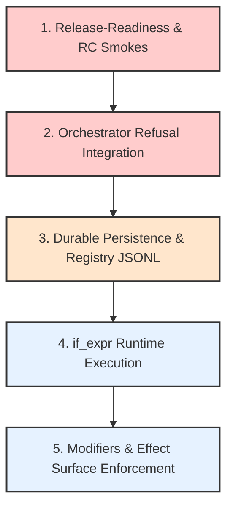

# Igniter-Lang Compiler: Gap Analysis, Vision & Recommendations

This report presents a thorough structural audit and strategic roadmap of the `igniter-lang` compiler workspace located at `/Users/alex/dev/projects/igniter/igniter-lang`. It maps theoretical specifications and proposals against verifiably implemented code, identifies the technical and architectural deltas, details core insights, and provides actionable recommendations on execution priorities.

---

## 1. Executive Summary & Context Map

`igniter-lang` is a contract-native, epistemic language research workspace. Unlike the parent `igniter` framework (focused on building operational ruby dependency graphs), `igniter-lang` operates as a **semantic wind tunnel** for verifying contract-native computation under strict boundaries: explicit time, observation-based trust, and capability-gated execution.

The codebase is currently in **Stage 3 (OPEN)**. Key milestones of Stage 1 & Stage 2 (lexer, monolithic parser, basic records, decimal typing, core/escape/oof classifier, typed SemanticIR emission, and MemoryBackend execution) have been successfully closed and frozen. Stage 3 is actively developing the **Compiler Profile & Policy Refusal System**, preparing the language for a modular, component-based assembly architecture.

### Current Horizon Setup
- **Production Pipeline**: `Parser -> Classifier -> TypeChecker -> emit_typed -> Assembler`
- **Compiler Paradigm**: Switched entirely to exclusive typed SemanticIR emission (`emit_typed`), preventing unresolved types or type variables from leaking into the assembled `.igapp` manifests.
- **Active Gate**: `Gate 3 Phase 1` (signed-approved-restricted live read). Bitemporal reads are supported proof-locally but restricted in production to history valid-time and MemoryBackend paths.

---

## 2. Specification & Proposal Delta (What is Not Yet Implemented)

To evaluate what is truly unimplemented, we must analyze the delta in three dimensions:
1. **Core Language Specification Chapters** (`docs/spec/`)
2. **Active and Queued Proposals** (`docs/proposals/`)
3. **Stage 2 Deferred Gaps** (carried into Stage 3)

### A. Spec Chapter Delta Matrix

The table below maps the 13 chapters of the language specification to their actual implementation status inside `lib/igniter_lang/` and verified proof state in `experiments/`.

| Spec Chapter | Scope | Status | Technical Delta / Gaps |
| :--- | :--- | :--- | :--- |
| **Ch 1: Identity** | Contract addressability, semantic nodes. | **Accepted** | Fully implemented in the compiler's model. |
| **Ch 2: Source Surface** | Source grammar, BNF, AST structure. | **Partially Implemented** | Monolithic parser supports core keywords, streams, points, and modifiers. <br>⚠️ **Delta**: Branch/conditional `if_expr` parser syntax is accepted only as compile-time AST proof, missing full runtime integration. |
| **Ch 3: Type System** | Basic types, record typings, Decimals. | **Implemented** | Decimals typing (Rule DEC-1) and record typings are verified. |
| **Ch 4: Classification** | Fragment classes (`core`, `escape`, `temporal`, `stream`, `oof`). | **Implemented** | The `Classifier` correctly assigns fragments and detects OOF codes. |
| **Ch 5: Pipeline** | Compiler Orchestrator, TypeChecker. | **Implemented** | Orchestrator uses typed emission (`emit_typed`). |
| **Ch 6: SemanticIR** | `CompiledGraph`, `.igapp` manifest. | **Implemented** | Emitter, Assembler, and CompilationReport are verified. |
| **Ch 7: Runtime** | `RuntimeMachine`, MemoryBackend. | **Partially Implemented** | Proof-local `MemoryBackend` and bitemporal read hooks are verified.<br>❌ **Delta**: Production database bindings (Ledger, TBackend) and CompatibilityReport runtime execution are strictly closed. |
| **Ch 8: Stdlib** | Collections, map, filter, fold. | **Implemented** | Iterative and list processing primitives are fully verified. |
| **Ch 9: Reserved** | `History[T]`, `BiHistory[T]`, Invariants. | **Partially Implemented** | Point-in-time and valid-time bitemporal read logic is proven.<br>❌ **Delta**: Invariant severity observations persistence is open. |
| **Ch 10: Modifiers** | Modifiers `pure`, `observed`, `effect`, etc. | **Partially Implemented** | Modifiers parser and typechecker proofs (`PROP-031`) are PASS.<br>❌ **Delta**: Modifiers runtime enforcement and Effect Surface validation are not implemented. |
| **Ch 11: Profiles** | Compiler Profile manifests and contracts. | **Partially Implemented** | Manifest fields (`PROP-036`) and strict-mode validator (`PROP-038`) are landed internally.<br>❌ **Delta**: Public CLI/API exposure, persisted reports, and dynamic pack loading are closed. |
| **Ch 12: Effects** | Effect Surface capability gating. | **Proposed Only** | `PROP-035` is queued. No implementation exists. |
| **Ch 13: Recursion** | Loop classes, liveness, service loops. | **Proposed Only** | `PROP-037` (External Progression) is accepted proposal-only. Loop classes are speculative. |

---

### B. Proposal Lifecycle Delta

The proposals register (`docs/proposals/README.md`) tracks active and queued features. Here is the exact status of the latest, high-signal proposals:

1. **PROP-028 (TEMPORAL Fragment Class) — `implemented-proof`**
    - *What is Implemented*: Classifier, TypeChecker, SemanticIR, Assembler manifest indexing, and MemoryBackend temporal load guard are fully proven.
    - *What is Open*: Full parser coordinate syntax and production runtime execution remain open.
2. **PROP-031 (Contract Modifiers) — `experiment-pass`**
    - *What is Implemented*: Prefix syntax parsing (`pure`, `observed`, `effect`, `privileged`, `irreversible`), implicit pure defaults, and Classifier `OOF-M1` checks are verified by proof.
    - *What is Open*: Effect Surface validation, profile declarations, and actual runtime executor modifiers enforcement remain unauthored/deferred.
3. **PROP-032 (Assumptions Block) — `experiment-pass`**
    - *What is Implemented*: `assumptions {}` grammar and `uses assumptions NAME` classifier fragment (`epistemic`) typechecking are verified in compiler shadow proofs.
    - *What is Open*: Bounded to compiler shadow proof only. `PROP-033` evidence validation and runtime receipt persistence are excluded.
4. **PROP-036 (Compiler Profile Manifest Identity) — `accepted`**
    - *What is Implemented*: Standalone fingerprinted `compiler_profile_source.stage3_proof.json` artifact format, assembler `compiler_profile_id` manifest field, orchestrator pass-through, facade mapping, and `--compiler-profile-source PATH.json` CLI transport are completed and verified (R54 release-confidence PASS).
    - *What is Open*: Loader/report integration, dynamic profile resolution, and runtime execution authorization remain blocked.
5. **PROP-037 (External Progression & Service Liveness) — `accepted`**
    - *What is Implemented*: Descriptor shape and diagnostic error codes (`OOF-PR1/2/3/4/5/7/9`) are proven report-only.
    - *What is Open*: Actual parser syntax, TypeChecker/SemanticIR loops support, RuntimeMachine scheduler, and liveness executors are strictly blocked.
6. **PROP-038 (Compiler Profile Contract / Validator) — `accepted`**
    - *What is Implemented*: Bounded internal validation loop, report-only annotation, shape-only policy verification, `contract_digest` mismatch calculations, and internal strict-mode compile refusal (`CompilerProfileContractValidator`) are landed in the main compiler.
    - *What is Open*: Public CLI/API integration, dynamic loader binding, and runtime capability checks are closed.

---

### C. Active Deferred Gaps Register

Several critical gaps deferred from Stage 2 are carried into Stage 3 as ongoing architectural targets:
- **`production_tbackend_adapter_binding`**: Strictly closed. Live reads/writes to real databases (like a distributed ledger) are not authorized. Only report-only compatibility matches are validated.
- **`olap_distributed_execution`**: Analytical scatter/gather, rolling aggregations, and distributed OLAP nodes remain unwritten.
- **`invariant_persistence`**: The compiler can lower `invariant_node` declarations to SemanticIR, but the runtime does not yet persist violation observation packets.
- **`deferred_invariant_oofs`**: Edge cases (`OOF-I1` bitemporal mismatch, `OOF-I3` temporal shape violation, `OOF-I5`) are deferred.
- **`gem_release_readiness`**: Rebuilding `.gem` locally and running release-gate verifications are verified, but actual push to RubyGems remains locked behind multi-factor auth gates.

---

## 3. The Compiler Vision: "Semantic Wind Tunnel"

The core vision of `igniter-lang` is **epistemic contract-native computation**. It rejects the traditional model of compiling general-purpose code with ambient, uncontrolled side-effects. Instead, it positions the compiler as a **mathematical checker** and the runtime as an **isolated, replayable state machine**.

```text
Source Contract (.ig)
  -> Static Analysis (CORE vs ESCAPE trust boundaries)
  -> Epistemic Verification (Assumptions & Modifiers)
  -> Frozen Abstract Output (.igapp)
  -> Isolated Execution (RuntimeMachine + Observation Receipts)
```

### The Theory-to-Devkit Spine
The compiler is designed to materialize a robust "spine":
1. **Time as a Native Coordinate**: Time (`History[T]`) is an immutable, addressable dimension of the language, not an ambient system clock query.
2. **Observations over Raw Results**: The system processes and returns validated "observation packets" (`Obs[T]`) signed with provenance and authority metadata, forming an audit-ready trail.
3. **The Pack-Assembled Compiler Platform**: The mid-term architectural goal is to shift from the current monolithic pipeline to the **Profile-Baseline-Pack** pattern (proven in parent project modules).
    - A language capability (like `Temporal` or `Stream`) is packaged as a `CompilerPack` declaring its own parser rules, type-checking constraints, and SemanticIR lowerings.
    - Developers compile contracts against a frozen, fingerprinted `CompilerProfile` that verifiably declares which packs were active. This guarantees that compiled bytecode carries an immutable cryptographic receipt of its compiler-stage requirements.

---

## 4. Architectural & Structural Insights

Through a deep review of the codebase and its historical development rounds, several profound insights emerge:

### Insight 1: Bounded Refusals as a Design Shield
The compiler makes heavy use of **compile-time refusals** and **strict-mode validator gates**. Rather than attempting to run a contract and throwing a runtime exception, the compiler uses the `Classifier` to isolate capability segments.
For instance, a `pure` contract attempting to invoke an `escape` block is rejected at static analysis with an `OOF-M1` code. This strict separation guarantees that runtime contracts are chemically inert unless explicitly declared otherwise.

### Insight 2: The Safety of Proof-Local Experiments
Igniter-Lang avoids architectural drift by employing a **three-phase digest proof chain**. Critical features (such as `contract_digest` calculation in `PROP-038` or expression-level `if_expr` branches) are developed first in isolated `experiments/` subdirectories. They are validated against exhaustive test matrices (often dozens of checks) before *any* public API exposure or library modifications are made. This process guarantees extreme stability for the core system.

### Insight 3: Monolith vs. Pack Transition Lag
While the target "Compiler Profile Architecture" (`docs/dev/compiler-profile-architecture-direction.md`) is clearly defined, the current compiler (`lib/igniter_lang/`) remains monolithic. There is a deliberate delay in extracting the `CoreLanguagePack`, `TemporalPack`, and `StreamPack` into modules. This is a brilliant strategic choice: **design boundaries are proven using the monolith first**, ensuring that when the modular partition occurs, the interfaces are already rigid and correct.

### Insight 4: Typing Parity Victory
Stage 3 represents a massive structural victory by enforcing **typed SemanticIR emission** (`emit_typed`). By deprecating untyped lowering, the compiler ensures that the assembled `.igapp` contains a fully monomorphized, type-sound AST. Any type variable mismatch or unresolved overloading is caught and refused before compilation completes.

---

## 5. Priority Recommendations: What to Close First

Based on the active Stage 3 scorecard, the existing design records, and the recommended next movements in `docs/agent-context.md`, here is a structured roadmap for what to implement next:



### 🔴 Phase 1: High-Priority Release & Refusal Boundaries (Implement First)

#### 1. Release-Readiness Polish & Official RC Compilation
- **Why**: The compiler has already passed local RC smokes (`repo_local_compiler_rc`) and package installation verifications.
- **Action**: Formalize the `--compiler-profile-source` CLI transport into the main release package. Clean up documentation boundary fences in `docs/ruby-api.md` and complete the final prerelease version bumping (`0.1.0.pre.rc1` or similar). This locks down the compiler-profile transportation pipeline.

#### 2. Compiler Orchestrator Strict-Refusal Integration
- **Why**: `CompilerProfileContractValidator` has successfully implemented strict-mode refusal and `contract_digest` validation internally, but they remain isolated from the primary CLI/API execution loops.
- **Action**: Connect the strict-mode validator directly to the main `CompilerOrchestrator` compilation thread. Ensure that a failed contract profile validation triggers a clean, diagnostic compile-refusal result in `CompilerResult` instead of a report-only warning, while maintaining public API safety boundaries.

---

### 🟡 Phase 2: Local Persistence & Storage Foundations (Implement Second)

#### 3. Durable Observation Persistence (JSONL Format)
- **Why**: Invariant violations and contract execution observations are generated by the compiler/runtime but currently reside only in memory. A durable, tamper-evident audit trail is required before production databases are bound.
- **Action**: Implement the proof-local JSONL observation persistence designed in Stage 3. Write a local appender that serializes observation packets (`ObsPacket`) with a cryptographic SHA256 linkage chain to local disk, keeping it gated strictly on `MemoryBackend` (excluding Ledger/TBackend adapters for now).

---

### 🔵 Phase 3: Language & Capability Enforcements (Implement Third)

#### 4. Expression-Level `if_expr` Runtime Integration
- **Why**: The type-checking rules (Rule IF-v0) and SemanticIR lowering for conditional branches (`if_expr`) are fully proven compile-time structures, but the runtime `SemanticIRExpressionEvaluator` cannot yet execute them.
- **Action**: Implement branch conditional evaluation inside `SemanticIRExpressionEvaluator` and `temporal_executor.rb`. This moves `if_expr` from a static AST structure to an executable language primitive.

#### 5. Modifiers & Effect Surface Enforcement
- **Why**: Modifier keywords (`pure`, `observed`, `effect`) parse and classification-reject statically, but their capability constraints are not yet checked at the runtime boundaries.
- **Action**: Design and implement `PROP-035` (Effect Surface). Write a runtime checker that validates execution receipts against the modifiers declared in the contract profile, ensuring that a contract marked `pure` cannot execute any capability belonging to `escape`.

---

## 6. Document Metadata & Archiving Rules

When implementing any of these recommendations:
1. **Maintain Integrity**: Keep monolithic passes monolithic until the proof chain reaches full closure. Do not introduce packs prematurely.
2. **CSM Compliance**: Any new compiler entity must be added to the Canonical Semantic Model (`docs/dev/canonical-semantic-model.md`). If it has no golden anchor in `experiments/`, its status must remain `spec_candidate`.
3. **Write Bounds**: Edits are restricted strictly to `igniter-lang/`. Unrelated platform files in the root worktree must be ignored.
