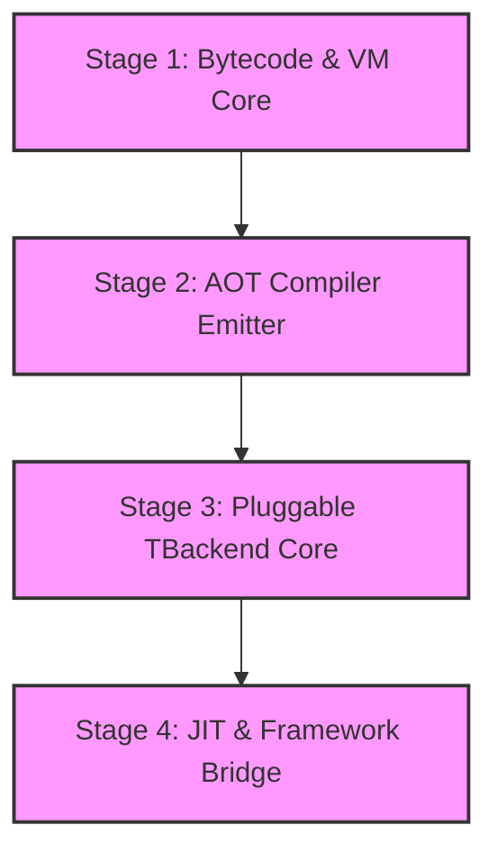

# Igniter-Lang Runtime: Gap Analysis, Native Architecture & Strategic Vector

This report presents a comprehensive structural audit, architectural design comparison, and strategic vision for the `igniter-lang` runtime located at `/Users/alex/dev/projects/igniter/igniter-lang`. It maps out the current gap between the theoretical specifications and Ruby-based interpreter, defines the vector for turning Igniter-Lang into an executable general-purpose language with a bitemporal twist, compares native runtime and interpreter models, and details the roadmap to execute this transition.

---

## 1. Runtime Current Horizon & Delta Analysis

The `igniter-lang` runtime is currently a **proof-local sandbox / semantic wind tunnel** implemented in Ruby. It exists to verify the mathematical axioms of the language, proving that contract-native lifecycle states (`boot -> load -> evaluate -> checkpoint -> resume`) can run verifiably under explicit temporal coordinates without process-memory leaks or unauthorized side effects.

### A. Implemented Runtime Components (`lib/igniter_lang/`)
1. **`temporal_executor.rb` (`TemporalExecutor::Phase1`)**
    - *Status*: Strictly gated for `History[T]` valid-time reads using an in-memory `MemoryBackend` under `Gate 3 Phase 1` (signed-restricted pre-live).
    - *Key Features*: Enforces `approval_token` validation before `gate_state` checks; validates `authority_ref` matching; excludes `BiHistory` and `CORE` fragments strictly via `runtime.temporal_scope_exclusion`; unconditionally emits `temporal_live_read_observation` envelopes.
2. **`semanticir_expression_evaluator.rb` (`SemanticIRExpressionEvaluator`)**
    - *Status*: Strictly internal expression-level interpreter for literals, references, and branch conditional `if_expr` (Slice 1 / Slice 2).
    - *Key Features*: Enforces strict, lazy condition-first evaluation of `if_expr`; rejects non-boolean condition values exactly (`ConditionNotBoolError`); supports fallback hooks (`external_evaluator`) for unsupported node kinds.

---

### B. The Specification vs. Code Delta (The Gaps)

Comparing [Ch7 Spec](file:///Users/alex/dev/projects/igniter/igniter-lang/docs/spec/ch7-runtime.md) and [Runtime Machine Spec](file:///Users/alex/dev/projects/igniter/igniter-lang/docs/runtime-machine.md) with the actual codebase reveals key unimplemented deltas:

| Spec Feature | Spec / Proposal | Ruby Code Status | Technical Gap (The Delta) |
| :--- | :--- | :--- | :--- |
| **`TBackend` Database Adapter** | PROP-008 | Proof-local `MemoryBackend` only. | ❌ **No Live Database Binding**: Real Ledger, SQL, or Key-Value store integrations remain strictly blocked. <br>❌ **No Persistent Replay/Compaction**: Replay, compact, snapshot, and subscribe interfaces are mock-only. |
| **Durable Audit Persistence** | PROP-021 / R30 | Memory array buffers. | ❌ **No Persistent Envelopes**: `temporal_live_read_observation` and `computation_observation` are emitted in-memory but never persisted to disk. |
| **Compatibility Verification** | Ch 7.6 / PROP-038 | Monolith-level compiler validator. | ❌ **No Dynamic Loading**: Validation of `.igapp` and `compilation_report.json` occurs at compiler-orchestrator level, not during dynamic `RuntimeMachine.load`. |
| **`if_expr` Execution** | R190 / Ch2 §2.2.3 | Isolated class proof. | ❌ **No Runtime Integration**: The expression-level evaluator (`SemanticIRExpressionEvaluator`) is direct-require-only and completely detached from the main execution facade (`IgniterLang.compile`). |
| **Effect Surface Gating** | PROP-031 / PROP-035 | Static classifier check (`OOF-M1`). | ❌ **No Runtime Enforcement**: Pure contracts do not enforce capability restrictions at execution; modifiers validation is statically checked but ignored by the runtime executor. |
| **Checkpoint & Resume** | Spec §7.5 | Memory mock proof PASS. | ❌ **No Schema Evolution**: Resume operations do not evaluate `provisional` or `downgraded` schema drifts; no actual `MigrationDecl` execution is wired. |

---

## 2. Interpreter vs. Native Runtime: Architectural Comparison

As we transition from a "semantic validation tool" to an "executable general-purpose language," we must compare the current **interpreter-based model** with a proposed **compiled native runtime**.

```text
========================================================================================
INTERPRETER MODEL (Current)
========================================================================================
[Compiled .igapp] -> [LoadedProgram (AST JSON)] -> [Expression Evaluator] -> [Ruby Value]
                                                           ^
                                                   (Traverses AST recursively)

========================================================================================
NATIVE RUNTIME MODEL (Target)
========================================================================================
[Compiled .igapp] -> [AOT Compiler] -> [Igniter Bytecode (.igbin)] -> [Stack-Based VM]
                                                                            ^
                                                                    (C / Rust / JIT Ruby)
```

### Comparative Analysis Matrix

| Metric | Interpreter Model (Ruby AST Traversal) | Native Runtime Model (Bytecode VM or compiled JIT) |
| :--- | :--- | :--- |
| **Execution Performance** | ❌ **Slow**. Recursively traversing AST JSON blocks incurs massive overhead. | ✅ **Extremely Fast**. Stack-based VM instructions execute near machine-speed. |
| **Memory Footprint** | ❌ **High**. Requires carrying the entire parsed AST tree and evaluation tables in-memory. | ✅ **Minimal**. Only loads the compact bytecode index and local register frames. |
| **Verification & Auditing** | ✅ **Perfect**. One-to-one mapping to formal axioms. Exceptional debuggability and AST introspection. | ⚠️ **Complex**. Requires verifying that the compiler's bytecode generation is semantics-preserving. |
| **Portability** | ⚠️ **Ruby-gated**. Tied directly to the Ruby interpreter loop. | ✅ **Universal**. Compiled bytecode can run inside C, Rust, WebAssembly, or lightweight JS/Ruby engines. |
| **Interoperability** | ✅ **Seamless**. Directly executes Ruby FFI closures and native hash bindings. | ⚠️ **Strict**. Requires well-defined FFI capability boundaries (`ESCAPE` gates). |

---

## 3. The Vision: Executable Bitemporal Audited Systems

### The Strategic Twist
An executable language with a bitemporal twist rejects both the **"verification-only"** academic trap and the **"ambient-effect"** unsafety of traditional programming languages:

1. **Academic Verification is a Non-Goal**: We do not build a theorem prover. The verification must serve the immediate execution of real business operations.
2. **First-Class Time and Provenance**: In general-purpose languages, time-travel, audit trails, and schema migrations are written as fragile, third-party database layers. In Igniter-Lang, **temporal tracking (valid-time), cryptographic traceability (ObsPacket), and strict capability boundaries are primitives of the runtime execution kernel**.

### The Hybrid General-Purpose Vector
Igniter-Lang compiles business logic into deterministic, content-addressed execution graphs. It behaves as a general-purpose engine with a unique "twist":
- It is **Epistemic**: Execution is mathematically guaranteed to honor stated assumptions (`uses assumptions`) and capability modifier bounds (`pure` vs `effect`).
- It is **Temporally Aware**: Memory is not a snapshot; it is a trajectory. The runtime native engine continuously computes projections over the temporal axis (`History[T]` and `BiHistory[T]`), guaranteeing that historical audits are instantaneous and perfectly reproducible.
- It is **Traceable**: Every evaluation step produces an immutable cryptographic receipt. This receipt is not a log file; it is a structural state assertion.

---

## 4. How to Approach a Native Runtime Implementation

To migrate the runtime from a Ruby-based AST interpreter to a native execution engine, we propose a **four-stage incremental build plan**:



### 🔹 Stage 1: Bytecode Specification & Virtual Machine (IVM)
- **Objective**: Design the **Igniter Virtual Machine (IVM)**, a stack-based, register-gated execution environment.
- **Implementation**:
    - Define a compact, binary-serializable bytecode format (`.igbin`).
    - Write the core IVM interpreter in C or Rust for absolute speed, or optimized Ruby for platform compatibility.
    - Implement basic instruction sets:
        - *Stack Ops*: `PUSH`, `POP`, `DUP`
        - *Pure Math/Logical*: `ADD`, `SUB`, `MUL`, `DIV`, `AND`, `OR`, `NOT`
        - *Control Flow*: `JMP`, `JMP_IF` (implements lazy `if_expr` evaluation), `CALL`, `RET`
        - *Time & Context*: `LOAD_AS_OF` (queries valid-time coordinate), `EMIT_OBS` (pushes an observation to the sink)

### 🔹 Stage 2: Ahead-of-Time (AOT) Compiler Emitter
- **Objective**: Build a compiler pass that translates typed SemanticIR (`emit_typed` output) directly to IVM bytecode.
- **Implementation**:
    - Write `IgniterLang::BytecodeEmitter` inside the compiler stack.
    - Map `literal_node` to `PUSH [value]`.
    - Map `compute_node` to register assignments and operator bytecode instructions.
    - Compile the `if_expr` branch structures into deterministic `JMP_IF` offset branches, completely eliminating AST recursive traversal overhead during execution.

### 🔹 Stage 3: Pluggable TBackend Adapter & State Substrate
- **Objective**: Decouple the execution engine from database details, providing a unified state interface.
- **Implementation**:
    - Enforce the abstract `TBackend` interface: `read(as_of)`, `append(observation)`, `replay(cursor)`, etc.
    - The IVM uses a pluggable state pointer. When executing `LOAD_AS_OF`, the VM calls the active `TBackend` adapter without knowing if the underlying database is an ephemeral in-memory table or a distributed Ledger.
    - Enforce the capability boundaries strictly: if a contract does not declare `temporal` or `escape` modifier permissions, the VM rejects bytecode instructions that query the `TBackend` adapter.

### 🔹 Stage 4: JIT & The Ruby Framework Bridge
- **Objective**: Integrate the fast native runtime back into the Ruby business framework loop, proving its operational value.
- **Implementation**:
    - Build a lightweight FFI bridge. The Ruby framework loads the compiled `.igapp` containing IVM bytecode, instantiates the VM, binds local database transactions behind `TBackend`, and runs evaluations at native speeds.
    - Enable JIT compilation for hot pathways: compile IVM bytecode directly into native Ruby blocks (`eval` with frozen bindings) or native machine instructions (via Rust-FFI), bypassing interpreter overhead entirely in production.

---

## 5. Implementation Roadmap & Priorities

Based on current Stage 3 boundaries and the active gap analysis, we recommend executing the runtime evolution in the following order:

### 🔴 Priority 1: Integrate the `if_expr` Evaluator (Implement First)
- **Goal**: Merge the isolated `SemanticIRExpressionEvaluator` (Slice 1 / Slice 2) directly into the main runtime facade (`IgniterLang::RuntimeMachine`).
- **Why**: Expression-level branch evaluation (`if_expr` lazy branches) is fully proven in `experiments/` but remains detached from the primary compiler CLI and execution loop. Linking it validates the interpreter's ability to handle recursive conditional routing in standard contracts.

### 🔴 Priority 2: Standardize the Tamper-Evident Observation persistence
- **Goal**: Transition from the in-memory array buffer inside `temporal_executor.rb` to a durable local storage mechanism.
- **Why**: Execution observations are mandatory for compliance auditing but are currently ephemeral.
- **Action**: Implement a local file appender that serializes observation envelopes (`temporal_read_observation` and `computation_observation`) to a flat JSONL ledger on disk. Chain the packets using SHA256 hashes (`phase1_observation_tamper_evidence_shape`), proving that audit trails cannot be modified retroactively without breaking the validation chain.

### 🟡 Priority 3: Composed CompatibilityReport Enforcement
- **Goal**: Move the composed CompatibilityReport validation from a report-only diagnostic into a strict runtime gate.
- **Why**: Currently, the loader accepts TEMPORAL contracts for inspection, but evaluate-time refusals are report-only.
- **Action**: Enforce `CompatibilityReport.runtime_enforced == true` at boot-time. If any required check (cache mismatch, expired token, missing authority reference) returns `blocked`, the `RuntimeMachine` must refuse to load the program entirely, locking the runtime gates.

### 🔵 Priority 4: Build the IVM Bytecode Prototype (Stage 1 Native Prototype)
- **Goal**: Create the first stack-based bytecode experiment in `experiments/`.
- **Action**: Author `experiments/igniter_virtual_machine_proof/` defining a 10-instruction bytecode set. Write a micro-VM in Ruby that runs Compiled SemanticIR translated into bytecode, proving performance parity and correctness.

---

## 6. Document Metadata & Verification Rules

- **Write Boundaries**: All runtime work must live strictly inside `igniter-lang/lib/igniter_lang/` or `experiments/`.
- **Exclusion Boundaries**: Do not introduce native C extensions or Rust FFI bindings into the main platform gem until the proof-local Ruby bytecode VM is fully closed.
- **Tamper Invariance**: Any new persisted observation must exactly match the cryptographic chain signature format specified in `experiments/phase1_observation_tamper_evidence_shape/`.
