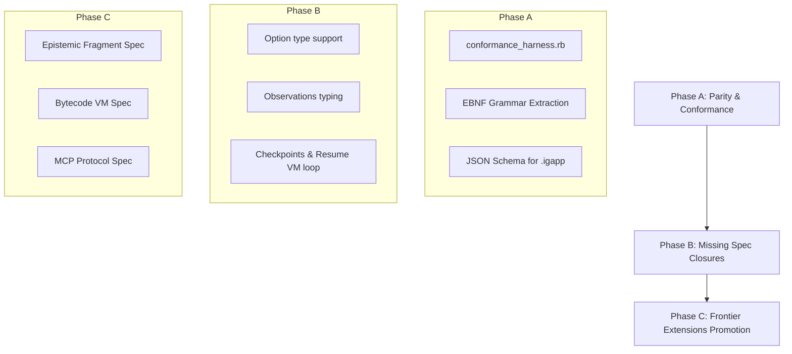

# META-EXPERT-014: Frontier Conformance Roadmap — Spec Delta, Conformance Harness & Extension Promotion v0

Card: S3-R60-C1-M (frontier conformance roadmap)
Agent: [Igniter-Lang Meta Expert]
Role: meta-expert
Date: 2026-06-02
Status: active governance
Supersedes: META-EXPERT-002 (extends compiler frontier target to alternative implementation certification)

---

## I. Situation

The alternative Rust-native implementation of the compiler and VM (`igniter-lab` comprising `igniter-compiler` and `igniter-vm`) has achieved full parity with, and in several lanes exceeded, the capabilities of the canonical Ruby codebase. 

While the reference Ruby implementation focuses on speculative design-first tracks, `igniter-lab` has established a robust, high-performance, ahead-of-time (AOT) bytecode compiler and sandboxed virtual machine. Specifically:
- **Phase 13 (Reactive Webhooks)**: Fully verified asynchronous stream-projection pipeline.
- **Phase 14 (Map-Reduce Aggregates)**: Complete static AST optimization and single-pass lazy collections iterator loop in Rust.

To certify `igniter-lab` as the first **certified alternative implementation** of `igniter-lang` and use its engineering to pressure-test the language specification, we must formalize the **spec/implementation delta**, build a **certification conformance harness**, and chart a path to promote `igniter-lab` innovations back into the canonical standard.

---

## II. Decisions

### Decision 1: Establishing the Conformance Test Suite (P0)

**Decision: Build a cross-implementation conformance test harness comparing Ruby vs. Rust compilation and VM execution.**

Rationale:
- A certified alternative implementation must prove byte-for-byte and execution-behavioral parity.
- We will establish `tests/conformance/` containing standardized `.ig` test scripts, input JSONs, and golden output JSONs.
- The test harness will execute both compilers and verify:
  1. Identical JSON AST structures generated from parser stages.
  2. Parity in compilation reports (identical diagnostics, warning severities, and error codes).
  3. Identical bitemporal observations and final outputs when executing compiled programs on both VMs.

### Decision 2: Standardizing the `.igapp` Format (P0)

**Decision: Draft and enforce a formal JSON Schema spec for `.igapp` manifests and contract metadata.**

Rationale:
- Currently, the `.igapp/` folder layout and file structures (e.g. `manifest.json`, `compatibility_metadata.json`, individual `contract.json` files) are verified implicitly by code.
- Without a formal, language-agnostic schema, third-party implementations cannot safely read or validate compiled igniter packages.
- We will author `docs/spec/ch6-appendix-igapp-schema.md` containing the formal schema.

### Decision 3: EBNF Grammar Formalization (P1)

**Decision: Extract and document the formal EBNF grammar from the `igniter-compiler` parser implementation.**

Rationale:
- Neither the spec nor the reference implementation has a formal grammar document, making parser validation fragile.
- We will document the complete grammar structure to serve as the ground-truth for syntax compliance.

### Decision 4: Promoting Frontier Extensions to Canon (P1)

**Decision: Draft meta-proposals to introduce `igniter-lab` innovations into the language specification.**

We will draft the following proposals:
1. **PROP-NEW-E (Epistemic Fragment Class)**: Codifying `uses assumptions` blocks, epistemic fragment classification, `ConfidenceLabel` variables, and the `OOF-CE4` verification checks.
2. **PROP-NEW-VM (Virtual Machine & Bytecode Specification)**: Standardizing the 25 core stack opcodes, `OP_MAP_REDUCE` serialized iterator pipelines, and bitemporal context load boundaries.
3. **PROP-NEW-MCP (Model Context Protocol Integration)**: Standardizing the MCP tool-server interface for igniter agents, enabling unified schema scans and read-write capabilities.

---

## III. Roadmap & Priority Matrix

We establish a clear, phased roadmap to bridge the gap and claim the Frontier:



### Phase A: Parity, Standardizing & Conformance (Immediate Focus)

| Target | Description | Deliverable | Priority |
|--------|-------------|-------------|----------|
| **1. JSON Schema** | Author formal schemas for `manifest.json`, `compatibility_metadata.json`, and Contract IRs. | `docs/spec/ch6-appendix-igapp-schema.md` | **P0** |
| **2. Conformance Harness** | Build an automated runner verifying Ruby vs. Rust compiler/VM parity. | `tests/conformance/conformance_runner.rb` | **P0** |
| **3. EBNF Grammar** | Document the complete source grammar derived from the Rust parser. | `docs/spec/ch2-appendix-ebnf-grammar.md` | **P1** |

### Phase B: Closing Missing Spec Gaps (Intermediate Focus)

| Target | Description | Deliverable | Priority |
|--------|-------------|-------------|----------|
| **1. Option[T] Support** | Add `Option[T]` syntax, typechecker logic, and VM handlers to address nullability. | Code update in parser + VM | **P1** |
| **2. Checkpoint & Resume** | Implement state checkpointing (generating semantic images) and VM loop resumption. | OP_CHECKPOINT / OP_RESUME in VM | **P1** |
| **3. Type-Safe Obs[K, T]** | Bind observations to concrete, type-safe structures instead of generic strings. | Typechecker signature check | **P2** |

### Phase C: Promoting Frontier Innovations to Canon (Strategic Focus)

| Target | Description | Deliverable | Priority |
|--------|-------------|-------------|----------|
| **1. Epistemic Spec** | Elevate `igniter-lab`'s epistemic classifier to a formal language chapter. | `docs/spec/ch10-epistemic-fragment.md` | **P2** |
| **2. VM Bytecode Spec** | Document the VM bytecode architecture and stack instructions. | `docs/spec/ch11-bytecode-vm.md` | **P2** |
| **3. MCP Protocol Spec** | Formally standardize model context protocol actions inside the engine. | `docs/spec/ch12-mcp-integration.md` | **P3** |

---

## IV. Requests to Neighboring Roles

**→ [Igniter-Lang Compiler/Grammar Expert]:**
1. Extract EBNF rules from `igniter-compiler`'s parser module.
2. Review proposed type-system changes for `Option[T]` nullability handling.

**→ [Igniter-Lang Research Agent]:**
1. Assist in compiling standard golden `.igapp` compilation targets for the conformance suite.
2. Maintain testing coverage across VM and compiler modules.

**→ [Igniter-Lang Applied Pressure Agent]:**
1. Write complex real-world contracts (e.g. multi-agent coordination loops) to pressure-test the map-reduce collection pipelines and identify syntax friction.

---

## V. Handoff

```text
Current:      Phase 14 (Map-Reduce) successfully implemented and verified in igniter-lab.
Next action:  Draft the EBNF grammar appendix and formalize the .igapp JSON Schema standard.
Then:         Build the automated conformance test harness cross-validating both compilers.
```
